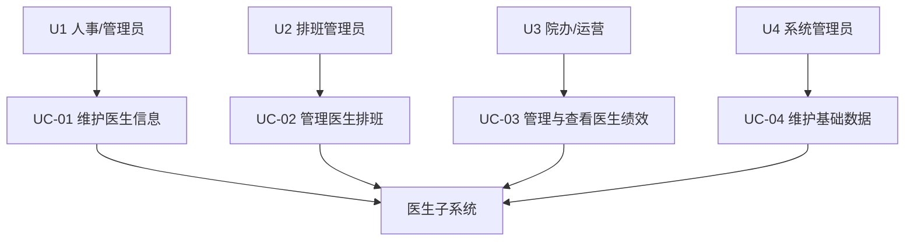

# 医生子系统需求与架构分析（课程报告版）

> 本文面向课程“软件工程”大作业报告，整体按照“第一部分 软件开发报告 / 第二部分 专题报告 / 第三部分 课程心得”的结构撰写。以医院综合管理系统为背景，重点说明本人负责的医生子系统在需求分析、软件设计、系统实现与测试中的具体工作，并结合大模型辅助需求分析与个性化学习体会进行总结。

---

## 第一部分 软件开发报告

### 第1章 概述
### 1.1 整体系统简介

本课程项目是一个基于前后端分离架构的**医院综合管理系统**，采用 Python Flask + MySQL 作为后端技术栈，Vue 3 + Element Plus 作为前端技术栈，实现：

- 患者信息与就诊记录管理
- 医生信息、排班与绩效管理
- 药品与药房库存管理

### 1.2 本人负责的医生子系统

我在团队中主要负责**医生子系统（Doctor Subsystem）**的分析与实现，核心职责包括：

- 医生基本信息管理（建档、查询、修改、离职处理）
- 医生排班管理（日/周排班、冲突检测、状态维护）
- 医生绩效管理（月度/年度绩效记录与统计与展示）
- 医生相关辅助数据服务（科室、职称等枚举数据接口）

---

## 2. 用户分析

### 2.1 典型用户角色

- **U1 医院人事/管理员**：维护医生档案、在职/离职状态、基础配置信息。
- **U2 门诊排班管理员/科室秘书**：为医生创建与调整排班，处理排班冲突与请假。
- **U3 院办/运营人员**：查看医生绩效统计与趋势，用于考核与运营分析。
- **U4 系统管理员**：维护科室、职称等基础数据，排查日志与异常。

### 2.2 用例图示意（Mermaid）

---

## 3. 需求分析

### 3.1 功能需求（摘录医生子系统部分）

- **FR-01 医生信息维护**：
  - 新增医生档案：录入工号、姓名、性别、年龄、电话、邮箱、科室、职称、学历、专长、入职日期等.
  - 编辑医生信息：除工号外，其余可按权限修改.
  - 查询医生列表：支持按姓名、工号、科室、职称、状态、年龄区间、学历等过滤.
  - 查看医生详情：展示个人信息和职业信息.
  - 标记医生离职：状态从 `active` 变为 `inactive`.

- **FR-02 医生排班管理与科室排班总览**：
  - 为医生创建日/周排班（日期、班次、时间段、最大接诊数、状态等）。
  - 更新和删除既有排班，所有操作记录到操作日志中.
  - 支持按医生、日期范围、班次、状态等多维度查询排班.
  - 内置排班冲突检测：班次冲突、时间段冲突、与请假记录冲突.
  - 提供科室排班总览接口：按科室和日期范围返回所有排班记录，支撑前端科室排班矩阵视图和请假模块中的排班抽屉.

- **FR-03 医生绩效管理**：
  - 录入医生某年某月的绩效数据（接诊人数、满意度评分、准时率、质量评分等）。
  - 由系统自动计算综合评分和绩效奖金，并可按医生/时间维度查询统计数据.
  - 前端按年度/月份维度展示绩效趋势图、KPI 卡片和明细表.

- **FR-04 医生请假管理**：
  - 医生提交请假申请，填写类型（病假/年假/事假/紧急/其他）、日期范围、替班医生与原因等.
  - 管理员对请假记录进行审批（通过/拒绝/撤销）并记录审批意见.
  - 请假记录与排班联动：排班创建/更新时检查是否与已批准请假冲突.

- **FR-05 医生资质证书管理**：
  - 为医生维护多种类型的资质证书（医疗执照、执业证书、专科证书、职称证书等）。
  - 记录证书编号、名称、颁发/过期日期、颁发机构、执业范围、附件 URL、状态等字段.
  - 后端在返回列表时提供 `is_expiring_soon` 标记，提示即将到期的证书，便于前端高亮提醒.

- **FR-06 辅助数据与统计服务**：
  - 提供科室列表接口：标准科室 + 数据库已有科室的并集，供前端下拉选项使用.
  - 提供职称列表接口：返回统一的职称枚举值.
  - 提供医生统计接口：统计总医生数、在职/离职人数、按科室和职称的分布情况等.

### 3.2 性能与质量需求

- **PR-01 列表查询性能**：
  - 在医生数量 < 5000、排班记录 < 5 万、绩效记录 < 5 万的前提下，
    - 医生列表/排班列表/绩效列表接口响应时间应 **≤ 1s**；
    - 含聚合统计的绩效查询接口响应时间应 **≤ 2s**.

- **QR-01 可维护性**：
  - 医生子系统在后端单独使用 Blueprint 与模块目录（`backend/modules/doctor`）。
  - 验证逻辑统一由 Marshmallow Schema 与工具函数封装，降低重复代码.

- **QR-02 可扩展性**：
  - 已预留医生资质、请假、排班模板等扩展模型，为后续迭代提供空间.
  - API 前缀与命名统一（`/api/doctor/...`），易于新增接口.

- **QR-03 可靠性与易用性**：
  - 前后端双层校验（前端 Element Plus 表单、后端 Schema），防止脏数据入库.
  - 操作日志记录关键业务动作，方便审计和故障排查.

### 3.3 开发与技术约束

- 后端必须使用 Python 3 + Flask + MySQL，ORM 使用 SQLAlchemy.  
- 前端必须使用 Vue 3 + Element Plus + Axios.  
- 所有接口通过 JWT 鉴权，并由 Axios 拦截器统一附加 Token.  
- 代码与文档组织需遵守课程给定的项目目录规范（如 `backend/modules/doctor`、`docs/` 等）。

---

### 第3章 软件设计

#### 3.1 系统体系结构设计

- 架构风格：前后端分离 + RESTful API。
- 前端：基于 Vue 3 + Element Plus + Vite 构建单页应用（SPA），医生子系统页面位于 `frontend/src/views/doctor` 目录。
- 后端：基于 Flask 的应用工厂 + Blueprint 架构，医生子系统 Blueprint 在 `backend/modules/doctor/__init__.py` 中定义，通过 `app.register_blueprint(doctor_bp, url_prefix='/api/doctor')` 暴露统一前缀的 REST 接口。
- 数据层：使用 SQLAlchemy 模型映射 MySQL 数据库中的 `doctors`、`doctor_schedules`、`doctor_performances`、`doctor_qualifications`、`doctor_leaves` 等表，扩展模型集中在 `backend/modules/doctor/models_extended.py`。

#### 3.2 软件结构设计

- 后端模块结构：
  - `backend/modules/doctor/routes.py`：实现医生信息、排班、绩效、请假、资质证书及统计等路由函数，并集成数据验证、冲突检测和操作日志记录。
  - `backend/modules/doctor/schemas.py`：定义 `DoctorSchema`、`DoctorScheduleSchema`、`DoctorPerformanceSchema`、`DoctorLeaveSchema`、`DoctorQualificationSchema` 等 Marshmallow 验证规则。
  - `backend/modules/doctor/models_extended.py`：定义 `DoctorQualification`、`DoctorLeave`、`DoctorScheduleTemplate`、`OperationLog`、`Notification` 等扩展模型及其 `to_dict()` 方法。
  - `backend/modules/doctor/utils.py`：封装排班/请假冲突检测、操作日志工具函数、统一验证装饰器等通用逻辑。

- 前端模块结构：
  - 视图组件：`DoctorList.vue`、`DoctorDetail.vue`、`DoctorSchedule.vue`、`DoctorPerformance.vue`、`DoctorLeave.vue`、`DoctorQualification.vue` 等，分别对应医生列表、详情、排班、绩效、请假和资质证书管理页面。
  - API 封装：`frontend/src/api/doctor.js` 负责医生、排班、绩效、请假等 API 调用，`frontend/src/api/qualification.js` 负责资质证书相关 API 调用。

#### 3.3 核心功能详细设计（摘选）

- 医生信息管理：
  - 前端在 `DoctorList.vue` 中提供搜索、筛选、分页和新增/编辑对话框；表单提交前先做前端校验（必填、手机号、日期等）。
  - 后端在 `POST/PUT /api/doctor/doctors` 路由中使用 `DoctorSchema` 验证请求体，并检查工号唯一性，成功后写入 `doctors` 表并记录操作日志。

- 科室排班总览：
  - 前端 `DoctorSchedule.vue` 调用 `/api/doctor/departments` 获取科室选项，再调用 `/api/doctor/doctors` 获取在职医生列表，最后调用 `/api/doctor/schedules/overview` 获取指定科室与日期范围内的所有排班记录，将其映射到“医生 × 日期 × 班次”的矩阵视图中。
  - 后端排班相关路由在创建/更新时调用 `utils.py` 中的增强冲突检测函数，检查班次、时间段和请假记录冲突，并在发现冲突时返回明确的错误信息。

---

### 第4章 系统实现

#### 4.1 编程语言及开发环境

- 后端：Python 3.x + Flask 3.x + Flask-SQLAlchemy + Flask-JWT-Extended，运行在本地 Windows 环境，数据库使用 MySQL 8.x。
- 前端：Vue 3.3 + Vue Router 4 + Pinia + Element Plus 2.4 + Axios 1.6，通过 Vite 5 进行开发与构建，依赖在 `frontend/package.json` 中列出。

#### 4.2 代码重用与规范实践

- 统一数据验证：所有医生相关数据在进入业务逻辑前均通过 `schemas.py` 中的 Schema 验证，路由层使用装饰器统一调用，避免重复编写验证代码。
- 统一操作日志：在增删改操作中统一调用 `log_operation()` 或使用日志装饰器，将操作者、资源类型、请求信息与结果状态写入 `operation_logs` 表，便于审计与问题排查。
- 统一冲突检测：排班与请假模块共用 `check_schedule_conflict_enhanced`、`check_leave_conflict` 等工具函数，实现对班次、时间段与请假记录的复用检测逻辑。

#### 4.3 测试计划与典型测试用例

- 接口测试：使用浏览器开发者工具或 API 调试工具（如 Thunder Client）对 `/api/doctor/doctors`、`/api/doctor/schedules`、`/api/doctor/leaves`、`/api/doctor/performances`、`/api/doctor/qualifications` 等核心接口进行手工测试，覆盖成功与失败场景。
- 前端联调测试：从登录开始，依次验证医生列表 → 详情 → 排班 → 请假 → 绩效 → 资质证书等页面在不同筛选条件下的展示与交互是否符合预期。
- 黑盒用例示例：
  - 新增医生时使用重复工号，期望返回 `DOCTOR_NO_EXISTS` 错误并拒绝创建记录。
  - 在已有批准请假的日期范围内创建排班，期望返回“请假冲突”错误。
- 白盒用例示例：
  - 针对排班冲突检测函数设计多组时间段覆盖用例，覆盖“无重叠/起点重叠/终点重叠/完全包含”等分支；
  - 针对删除医生的路由函数设计有无预约、有无病历等多种组合，验证防护分支是否正确阻止误删。

---

## 第二部分 专题报告

### 第1章 大模型辅助的需求分析

#### 1.1 自主独立完成的初始需求（1.0 版）

在未使用大模型之前，我基于课程理论和对医院业务的理解，独立完成了医生子系统的初版需求分析，覆盖：

- 功能需求：医生信息 CRUD、排班 CRUD+冲突检测、绩效录入与统计、辅助数据接口等；
- 质量需求：初步提出“性能要快、系统易维护、支持扩展”等目标；
- 开发约束：确认使用 Flask + Vue 3 + MySQL，采用 RESTful API 和 JWT 鉴权.

这一版本的主要不足是：部分功能描述粒度较粗（如“医生管理”只是一句话），质量需求缺乏可验证指标，对冲突检测和错误处理边界考虑不够细致.

#### 1.2 拟定需求修订规则与大模型辅助（2.0 版）

在 1.0 版本基础上，我先拟定了需求评审标准，如：

- 覆盖性：是否覆盖医生信息 / 排班 / 绩效 / 辅助数据全部关键场景；
- 一致性：需求与当前数据库模型、后端路由、前端页面是否一致；
- 可验证性：质量需求是否具备可量化指标（响应时间、并发数等）；
- 可实现性：是否在课程时间和技术栈约束下可落地实施；
- 可追踪性：能否映射到具体模块和接口，支持后续测试设计.

然后将 1.0 版需求及上述评审标准提供给大模型，请其：

- 按“功能 / 质量 / 约束”三维检查是否存在遗漏或表述不清；
- 对照当前代码结构和数据库模型，指出命名和取值上的不一致；
- 建议合理的性能指标范围与质量需求表述方式；
- 帮助细化“医生管理”“排班管理”等过于粗粒度的条目.

大模型给出的修订建议形成了 2.0 版本，重点改进包括：

- 将“医生管理”拆分为多条具体 FR（新增、编辑、查询、详情、离职等）；
- 明确排班冲突检测包括班次冲突、时间段冲突、请假冲突三类；
- 为性能需求补充具体数值（例如列表 ≤1s、统计 ≤2s）；
- 将“易维护、可扩展”等抽象质量需求映射到 Blueprint 模块化、Schema 统一验证、扩展模型预留等具体设计上；
- 修正个别字段命名与枚举值，使之与实际实现一致.

#### 1.3 自主独立审定与定稿（3.0 版）

在获得 2.0 版修订建议后，我并未直接全盘接受，而是基于以下原则进行 3.0 版审定：

- 与课程目标一致：删除超出课程时间和当前实现范围的“过度理想化”需求，仅在“演进规划”中保留展望；
- 与技术可行性匹配：确保每一条需求在当前技术栈和个人能力范围内可落地实施；
- 与现有实现契合：逐条对照后端路由、数据模型和前端页面，修正描述与实现不一致的地方.

最终形成的 3.0 版本既保留了大模型提出的合理改进，又牢牢围绕课程项目的边界和当前实现情况，成为后续开发、测试和撰写课程报告时的定稿需求.

在专题报告中，我计划通过**对比表格 + 大模型对话记录附录**两种方式展示这三轮迭代的痕迹，体现出“先独立思考、再借助大模型优化、最后再由人审定”的完整软件工程过程.

### 第2章 个性化学习总结

在医生子系统的开发过程中，我结合课堂学习内容，重点在以下两个方向上进行个性化实践与总结：

- **方向一：面向实际业务的后端设计实践**  
  通过将数据验证、日志记录、排班/请假冲突检测等逻辑抽取到 `schemas.py` 与 `utils.py` 中，我更加理解了“将通用逻辑从路由中剥离”的重要性，也体会到 Blueprint + 模块目录在大型系统中的作用.

- **方向二：前端交互与可视化设计**  
  在 `DoctorSchedule.vue` 和 `DoctorPerformance.vue` 中尝试实现排班矩阵与绩效趋势图，使我对“如何围绕业务场景设计数据结构和交互方式”有了更深刻的认识，也加深了对 Vue 3 Composition API 与 Element Plus 组件的掌握.

这些实践让课堂上关于架构设计、模块划分、前后端协作等理论知识真正落地到代码与页面上，而不仅仅停留在 PPT 与图示层面.

---

## 第三部分 课程心得

### 第1章 课程体会

- **课程内容层面**：  
  通过从需求分析、总体设计、详细设计到实现与测试的完整实践，我对软件工程“文档驱动开发”的价值有了切身体会. 课程让我们在统一架构下各自负责一个子系统，既体验了规范带来的好处，也体会了团队协作中的约束.

- **课程思政层面**：  
  在医生子系统中，我需要处理大量与个人隐私和医院运营相关的信息，这让我更加理解“职业规范”和“科技向善”的重要性——例如为敏感接口增加严格的鉴权与日志，对操作行为进行可追溯记录等，这些都体现了工程师应有的社会责任.

### 第2章 课程收获与展望

- **综合收获**：  
  通过本课程，我完成了一个小型前后端分离系统从 0 到 1 的构建过程，理解了从需求到实现再到测试与文档的完整闭环；同时，在实践中学会了与大模型进行有效协作，而不是完全依赖或排斥它.

- **后续展望**：  
  如果有更多时间，我希望为医生子系统补充自动化测试与简单的性能压测，并进一步完善操作日志查询、通知提醒等扩展功能，使整个子系统更接近真实医院信息系统的要求.